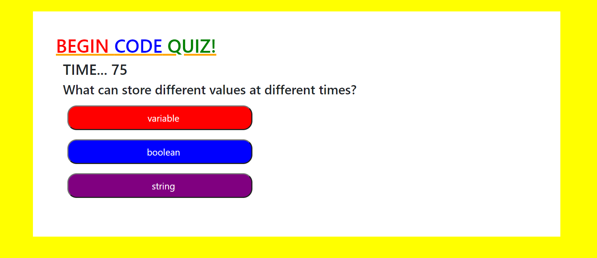

# code_quiz

>The purpose of this assignment was to create a quiz on Javascript fundamentals using Javascript. This quiz is to be timed and render a score after completion. 

[Code Quiz](https://jpanakkal22.github.io/code_quiz/)
